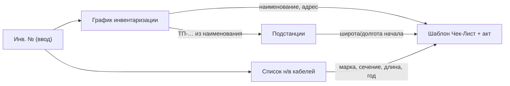

# SKS — генератор чек-листа и акта инвентаризации кабельных линий

Автоматизация заполнения выходного отчёта **«Чек-Лист + акт»** по **инвентарному номеру** кабельной линии (КЛ) на основании справочных Excel-файлов УльГЭС / ЦПО.

Python-генератор читает три справочника из `Data/`, заполняет шаблон и сохраняет готовый `.xlsx` в `output/` **без внешних ссылок Excel** (`[1]`, `[2]`, `[3]`).

---

## Быстрый старт

### Установка

```bash
python -m venv .venv
.venv\Scripts\activate          # Windows
pip install -r requirements.txt
```

Исходные Excel-файлы положите в каталог `Data/` (см. [Исходные данные](#исходные-данные-data)).

### Один чек-лист

```bash
python scripts/make_checklist.py 7260
python scripts/make_checklist.py 7260 --act 4167 --date 2026-06-20
```

Результат: `output/чек-лист_7260.xlsx`. Если у инв. № больше 10 объектов (строк кабеля) — несколько файлов: `чек-лист_7260_1.xlsx`, `…_2.xlsx`, …

### Пакетная (асинхронная) генерация

```bash
# все номера, для которых есть данные и в графике, и в списке кабелей (~6200)
python scripts/make_checklists_async.py

# только указанные номера
python scripts/make_checklists_async.py --inv 7260 425 1234

# с параметрами акта и параллелизмом
python scripts/make_checklists_async.py --inv 7260 --act 4167 --date 2026-06-20 --workers 10 -o output/
```

| Параметр | Описание |
|----------|----------|
| `--inv N [N …]` | инв. номера; если не указаны — все из графика |
| `--act N` | номер акта (ячейка E3) |
| `--date ДД.ММ.ГГГГ` | дата акта (ячейка G3) |
| `-o`, `--output-dir` | каталог вывода (по умолчанию `output/`) |
| `--workers N` | параллельных задач (по умолчанию `10`) |
| `--no-progress` | не показывать прогресс-бар |

**Порядок работы** `make_checklists_async.py`:

1. **Preflight** — проверка наличия файлов, загрузка справочников, проверка столбцов.
2. **Сопоставление инв. №** — отчёт о номерах, для которых чек-лист создать нельзя (есть только в одном из двух справочников).
3. **Координаты ТП/РП** — отчёт о подстанциях без записи в справочнике или без широты/долготы (чек-листы всё равно создаются, координаты останутся пустыми).
4. **Генерация** — параллельное создание файлов с прогресс-баром.

Прерывание **Ctrl+C** — уже созданные файлы сохраняются, код выхода `130`.

---

## Структура проекта

```
SKS/
├── Data/                              # Исходные Excel (не в git)
├── templates/
│   └── чек-лист_акт_шаблон.xlsx       # Шаблон выходного документа
├── scripts/
│   ├── make_checklist.py              # Один инв. № (синхронно)
│   ├── make_checklists_async.py       # Пакетная генерация
│   └── make_template.py               # Служебный: подготовка шаблона
├── src/
│   ├── generator.py                   # Заполнение шаблона
│   └── loaders/                       # Чтение справочников
│       ├── schedule.py                # График инвентаризации [1]
│       ├── cables.py                  # Список н/в кабелей [3]
│       ├── substations.py             # Подстанции с координатами [2]
│       └── paths.py                   # Пути к файлам в Data/
├── output/                            # Сгенерированные отчёты
└── requirements.txt
```

---

## Исходные данные (`Data/`)

| Файл | Роль | Листы | Записей (порядок) |
|------|------|-------|-------------------|
| `График_инв_УльГЭС нв кабели от 23062026.xlsx` | График инвентаризации — **главный реестр** по инв. № | `Общий график` | ~6 400 строк |
| `Список н_в кабелей для инветаризации 25062026.xlsx` | Технические параметры КЛ по районам | `сет р-он 1` … `сет р-он 5`, `списанные` | ~6 300 уникальных инв. № |
| `подстанции с координатами.xlsx` | Координаты ТП/РП (начало трассы) | `Лист1` | ~1 700 объектов |
| `Чек-Лист + акт 1.xlsx` | Исходный Excel-шаблон (прототип) | ` акт заполняем первым`, `Лист осмотра КЛ заполняем втор` | — |

> **Шаблон для генератора:** `templates/чек-лист_акт_шаблон.xlsx` — подготовленная копия без внешних ссылок.

### 1. График инвентаризации

Ключевые столбцы листа `Общий график` (строка заголовков — 9):

| Столбец | Поле | Использование в отчёте |
|---------|------|------------------------|
| D | Диспетчерское наименование | Акт: `D7`; чек-лист: наименование объекта |
| E | Адрес местонахождения | Акт: `D16`, `G15`; чек-лист: адрес |
| F | Район обслуживания | Справочно |
| G | Индивидуализирующие характеристики | Справочно (год ввода, сечение и т.д. в тексте) |
| **H** | **Инвентарный номер АО УльГЭС** | **Ключ поиска** (`J1` в шаблоне) |
| I | Протяжённость, м | Справочно |

Поиск: `MATCH(инв_№, колонка H)` → номер строки → `INDEX` по D и E.

### 2. Список н/в кабелей

Пять районных листов с **разной структурой заголовков** (строка 1 или 2), но общей семантикой:

| Столбец (типично) | Поле | Использование |
|-------------------|------|---------------|
| A | Текстовое наименование кабеля | Сверка с графиком |
| **B** | **Инв. №** | Ключ VLOOKUP |
| C | ТП | Извлечение `ТП-XXXX` для координат |
| F | Почтовый адрес | Акт: уточнение адреса |
| G | Принадлежность (баланс) | Справочно |
| **H** | **Марка кабеля** | Акт: `D44`; чек-лист: `J9` |
| **I** | **Сечение** | Акт: `E44`; чек-лист: `K9` |
| **J** | **Длина, м** | Акт: `H44` (км); чек-лист: `N9` |
| K | Год ввода | Чек-лист: `D9` *(в шаблоне пока вручную)* |

Поиск: каскадный `VLOOKUP` по листам 1→2→3→4→5, столбец B.

**Важно:** у ~854 инв. № есть **несколько строк** (разные рубильники/участки). Пример: инв. `7260` — 2 строки, инв. `2245` — до 26. В Excel `VLOOKUP` берёт **первое** совпадение.

Лист `списанные` в текущем шаблоне **не используется**.

### 3. Подстанции с координатами

| Столбец | Поле | Использование |
|---------|------|---------------|
| A (`Name`) | Имя ТП/РП, напр. `ТП-4007` | Ключ поиска |
| B (`Description`) | Адрес | Справочно |
| L, M | Широта, долгота | Чек-лист: `F9`, `G9` (начало КЛ) |

Ключ для координат извлекается из диспетчерского наименования формулой: подстрока `ТП-…` или `РП-…` (ячейка `V9`).

### 4. Шаблон «Чек-Лист + акт 1.xlsx»

Два листа, порядок заполнения указан в названиях.

#### Лист « акт заполняем первым»

**Ввод пользователя (минимум):**

| Ячейка | Поле | Пример |
|--------|------|--------|
| `J1` | Инвентарный номер | `7260` |
| `E3` | Номер акта | `4167` |
| `G3` | Дата акта / осмотра | `20.06.2026` |

**Заполняется автоматически из графика** (при наличии внешней ссылки `[1]`):

- `D7` — диспетчерское наименование
- `D16`, `G15` — адрес

**Заполняется из списка кабелей** (`[3]`):

- `D44` — марка
- `E44` — сечение
- `H44` — длина (км)

**Задаётся в шаблоне константами** (не из справочников):

- Субъект РФ, организация-эксплуатант, тип оборудования (`КЛ`, `0.4 кВ`), основание осмотра, состав комиссии и т.д.

#### Лист «Лист осмотра КЛ заполняем втор»

Большая часть тянется с листа акта. Дополнительно:

| Поле | Источник | Статус в шаблоне |
|------|----------|------------------|
| Координаты начала (F9, G9) | `подстанции` по `ТП-…` | Формула ✅ |
| Марка, сечение, длина, инв. № | Лист акта | Формула ✅ |
| **Год ввода (D9)** | Список кабелей, столбец K | Заполняется генератором ✅ |
| **Координаты конца (H9, I9)** | — | **Вручную** (заглушки `1111` / `111`) |
| Блок осмотра (статусы, дефекты) | Полевые данные | **Вручную** |

---

## Внешние ссылки Excel `[1]`, `[2]`, `[3]`

В формулах шаблона `Чек-Лист + акт 1.xlsx` встречаются конструкции вида `'[1]Общий график'!$H:$H`. Это **псевдонимы внешних книг** — Excel привязывает к шаблону другие файлы и обращается к ним по порядковому номеру.

Синтаксис: `'[N]ИмяЛиста'!Диапазон`, где `N` — номер подключённой книги, а не файл в репозитории.

### Соответствие ссылок и файлов

| Ссылка | Файл в `Data/` | Листы | Что берётся в отчёт |
|--------|----------------|-------|---------------------|
| **`[1]`** | `График_инв_УльГЭС нв кабели от 23062026.xlsx` | `Общий график` | Диспетчерское наименование, адрес; поиск строки по инв. № в столбце H |
| **`[2]`** | `подстанции с координатами.xlsx` | `Лист1` | Широта и долгота ТП/РП по имени (`ТП-4007` и т.п.) |
| **`[3]`** | `Список н_в кабелей для инвентаризации 25062026.xlsx` | `сет р-он 1` … `сет р-он 5` | Марка, сечение, длина по инв. № (каскадный VLOOKUP) |

### Примеры формул из шаблона

```excel
MATCH(J1, '[1]Общий график'!$H:$H, 0)
```
→ ищет инв. № из ячейки `J1` в графике, возвращает номер строки

```excel
INDEX('[1]Общий график'!$D:$D, J2)
```
→ по найденной строке подставляет диспетчерское наименование

```excel
VLOOKUP(J1, '[3]сет р-он 1'!$B$1:$H$65536, 7, 0)
```
→ ищет инв. № в списке кабелей (с перебором листов 1→5 через `IFERROR`)

```excel
VLOOKUP(V9, [2]Лист1!$A:$L, 12, 0)
```
→ по коду ТП/РП из наименования подставляет широту (столбец 12)

### Ограничения

- Ссылки работают **только если Excel находит файлы** по тому пути, который был при создании шаблона. При переносе папки, переименовании или открытии на другом ПК формулы ломаются — Excel предлагает «обновить связи».
- Все три внешние книги привязаны как `.xlsx` (ранее `[2]` ошибочно указывал на `.xls`).
- Python-генератор (целевое решение) читает те же три файла напрямую из `Data/` и **не использует** `[1]`, `[2]`, `[3]`.

---

## Схема данных



---

## Реализовано

- Загрузка трёх справочников из `Data/` с адаптацией разных заголовков листов кабелей.
- Заполнение шаблона: наименование, адрес, марка, сечение, длина, год ввода, координаты начала (если есть в справочнике подстанций).
- Несколько объектов на один инв. № — отдельные строки в акте/чек-листе; при >10 объектах — разбиение на несколько файлов.
- CLI для одного номера (`make_checklist.py`) и пакетная асинхронная генерация (`make_checklists_async.py`).
- Preflight-проверки, отчёты о расхождениях инв. № и подстанциях без координат.
- Прогресс-бар, обработка Ctrl+C.

## Ревью ТЗ (архив)

Ниже — анализ постановки задачи на основе фактической структуры файлов и текущего шаблона. Это основа для согласования перед разработкой.

### Что уже ясно и согласовано

1. **Единственный ключ** — инвентарный номер АО УльГЭС (столбец H графика, столбец B списка кабелей).
2. **Выходной документ** — фиксированный шаблон с двумя листами; меняется содержимое, не структура.
3. **Три справочника** покрывают основные реквизиты акта и строку чек-листа.
4. **Прототип логики** уже есть в Excel и может служить эталоном полей.

### Пробелы и неоднозначности (нужно уточнить)

| # | Вопрос | Риск | Рекомендация |
|---|--------|------|--------------|
| 1 | **Дубликаты инв. №** в списке кабелей (854 номера, до 26 строк). Брать первую строку, суммировать длины, выводить несколько строк чек-листа? | Неверная длина/марка в акте | Зафиксировать правило; для акта логично **суммировать длину**, для марки/сечения — если одинаковые, любая; если разные — предупреждение |
| 2 | **Год ввода** (`D9`): в шаблоне вручную, в справочнике есть столбец K, в графике — в тексте колонки G. Какой источник приоритетный? | Расхождение данных (пример: `7260` → 1998 vs 1971) | Приоритет: список кабелей → парсинг графика → пусто + предупреждение |
| 3 | **Координаты окончания КЛ** (`H9`, `I9`) — откуда брать? В справочниках нет. | Пустые или фиктивные значения в отчёте | Оставить пустыми / ввод вручную после генерации / отдельный источник |
| 4 | **Напряжение** (`F13` = `0.4`) — всегда 0.4 кВ или из графика (колонка G)? | Неверное напряжение для 6/10 кВ | Уточнить: константа или парсинг |
| 5 | **Номер и дата акта** (`E3`, `G3`) — автонумерация или ввод? | — | В ТЗ: обязательный ввод; опционально — автоинкремент |
| 6 | **Лист `списанные`** — генерировать для списанных кабелей или блокировать? | Акт по неактуальному объекту | Явное предупреждение при попадании в `списанные` |
| 7 | **Полевой блок чек-листа** (дефекты, муфты, статусы) — входит в автоматизацию? | Раздувание scope | Исключить из v1; оставить пустым |
| 8 | **Константы акта** (комиссия, договор, организация) — общие для всех или настраиваемые? | Пересборка шаблона | Вынести в `config.yaml` / отдельный лист настроек |
| 9 | **Пакетная генерация** — один инв. № или список / весь график на дату? | — | ✅ `make_checklists_async.py`: `--inv` или весь график |
| 10 | **Формат выхода** — один файл на кабель или один файл с несколькими актами? | — | ✅ один `.xlsx` на инв. № (или `_1`, `_2` при >10 объектах) |

### Технические риски текущего Excel-прототипа

1. **Внешние ссылки** `[1]`, `[2]`, `[3]` — см. раздел [«Внешние ссылки Excel»](#внешние-ссылки-excel-1-2-3); привязаны к путям на диске, легко ломаются при переносе.
2. **Разные строки заголовков** на листах списка кабелей (1, 2 или 3) — при программном чтении нужен адаптер по листам.
3. В списке кабелей много **пустых строк-разделителей** между группами — читать с пропуском пустых.
4. Имена листов с пробелами (`сет р-он 3 ` с хвостовым пробелом) — учитывать буквально.

### Scope v1 (MVP) — выполнено

- CLI: `scripts/make_checklist.py`, `scripts/make_checklists_async.py`
- Загрузка трёх справочников из `Data/`
- Заполнение шаблона `templates/чек-лист_акт_шаблон.xlsx`
- Подстановка: наименование, адрес, марка, сечение, длина, координаты начала, год ввода
- Сообщения: «не найден», расхождения справочников, подстанции без координат

**Не входит:**

- GUI
- Редактирование полевого блока осмотра
- Координаты конца трассы
- Автообновление справочников
- `config.yaml` для констант акта

### Критерии приёмки

1. Для инв. № `7260` сгенерированный файл совпадает с эталоном по автозаполняемым полям (наименование, адрес, марка `ААБ`, сечение `3х35+1х16`, длина 30 м, координаты ТП-4007).
2. Для несуществующего инв. № — понятная ошибка, файл не создаётся.
3. Шаблон открывается в Excel без «Восстановить связи».
4. Константы акта (комиссия, договор) задаются в шаблоне.

---

## Эталонный пример

Инв. № **7260** в текущем шаблоне:

| Поле | Значение |
|------|----------|
| Наименование | н/в кабель от ТП-4007 на ул.Жуковского,66 |
| Адрес | г. Ульяновск, Заволжский район, ул.Жуковского,66 |
| ТП | ТП-4007 |
| Координаты начала | 54.349611°, 48.548525° |
| Марка / сечение | ААБ / 3х35+1х16 |
| Длина | 30 м (0.03 км в акте) |
| Год в справочнике | 1971 |

---

## История данных

| Файл | Дата в имени | Примечание |
|------|--------------|------------|
| График | 23.06.2026 | Актуальный график |
| Список кабелей | 25.06.2026 | Версия для инвентаризации |

При обновлении справочников достаточно заменить файлы в `Data/` с теми же шаблонами имён (см. `src/loaders/paths.py`).

---

## Git

Репозиторий: [github.com/kirag-ozyaz/cable-inventory-act-generator](https://github.com/kirag-ozyaz/cable-inventory-act-generator)

В git попадают только код, шаблон и README. Каталоги `Data/`, `output/`, `.venv/`, IDE и скрытые файлы (`.people.xlsx` и др.) — в `.gitignore`.

### Первый коммит и push

```powershell
cd X:\Project\SKS

git rm -r --cached -f .
git add .gitignore README.md requirements.txt main.py scripts/ src/ templates/
git status

git commit -m "Initial commit: cable inventory checklist and act generator"
git branch -M main
git remote add origin https://github.com/kirag-ozyaz/cable-inventory-act-generator.git
git push -u origin main
```

Если `origin` уже добавлен:

```powershell
git remote set-url origin https://github.com/kirag-ozyaz/cable-inventory-act-generator.git
git push -u origin main
```

> Пока нет ни одного коммита, `git reset HEAD` не работает — используйте `git rm -r --cached -f .`

### Убрать файл из git, но оставить на диске

```powershell
git rm --cached "templates/.people.xlsx"
git add .gitignore
git commit -m "Stop tracking local template file"
git push
```

### Обычные изменения

```powershell
git add .
git status
git commit -m "Описание изменений"
git push
```
