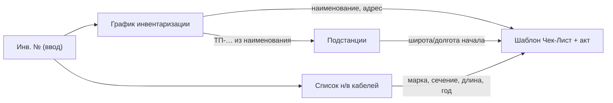

# SKS — генератор чек-листа и акта инвентаризации кабельных линий

Автоматизация заполнения выходного отчёта **«Чек-Лист + акт»** по **инвентарному номеру** кабельной линии (КЛ) на основании справочных Excel-файлов УльГЭС / ЦПО.

Python-генератор читает три справочника из `Data/`, заполняет шаблон и сохраняет готовый `.xlsx` в `output/`. Данные из `Data/` подставляются **значениями** (без ссылок `[1]`, `[2]`, `[3]`). Блок представителей на листе чек-листа по-прежнему тянется из **`templates/.people.xlsx`** — при генерации этот файл **копируется** в каталог вывода рядом с чек-листами.

**Рекомендуется генератор v2** (`scripts/v2/`) — сохраняет оформление шаблона (границы, стили, область печати) в Excel 2016 и 2021. Старые скрипты в `scripts/v1/` оставлены для совместимости. Bat-файлы упаковки `data.7z` — в `scripts/pack/`.

---

## Каталог `scripts/`

| Папка | Назначение | Основные файлы |
|-------|------------|----------------|
| **`scripts/v2/`** | Генерация чек-листов (рекомендуется) | `make_checklist.py`, `make_checklists_async.py`, `compare_xlsx.py` |
| **`scripts/v1/`** | Генерация через openpyxl.save (устарело) | `make_checklist.py`, `make_checklists_async.py`, `make_template.py` |
| **`scripts/pack/`** | Ручная упаковка / распаковка `data.7z` | `pack_data.bat`, `unpack_data.bat` |

```powershell
# v2 — один чек-лист
python scripts/v2/make_checklist.py 7260

# v2 — пакет
python scripts/v2/make_checklists_async.py --inv 7260 425 --workers 10

# v1 — только если нужна совместимость со старым save
python scripts/v1/make_checklist.py 7260

# data.7z вручную
scripts\pack\pack_data.bat
scripts\pack\unpack_data.bat
```

---

## Быстрый старт

### Установка

```powershell
python -m venv .venv
.venv\Scripts\activate
pip install -r requirements.txt
```

Исходные Excel-файлы положите в каталог `Data/` (см. [Исходные данные](#исходные-данные-data)).

### Генератор v2 (рекомендуется)

Скрипты в **`scripts/v2/`** — zip-merge: openpyxl считает значения и структуру листов, финальный `.xlsx` собирается из zip шаблона. **`styles.xml`**, drawings, printerSettings и индексы стилей ячеек остаются из `templates/чек-лист_акт_шаблон.xlsx`.

| | **Один номер** — `scripts/v2/make_checklist.py` | **Пакет** — `scripts/v2/make_checklists_async.py` |
|---|---------------------------------------------------|-----------------------------------------------------|
| **Когда использовать** | один инв. №, проверка, отладка | массовая генерация (~6200 номеров или свой список) |
| **Инв. №** | позиционный аргумент (`7260`) | `--inv 7260 425 …`; без `--inv` — все номера из пересечения графика и списка кабелей |
| **Параллелизм** | нет | `--workers N` (по умолчанию `10`) |
| **Preflight / расхождения** | нет | да (как в v1) |
| **Оформление xlsx** | как в шаблоне ✅ | как в шаблоне ✅ |

```powershell
# один чек-лист
python scripts/v2/make_checklist.py 7260
python scripts/v2/make_checklist.py 7260 --act 4167 --date "20.06.2026"

# пакет
python scripts/v2/make_checklists_async.py
python scripts/v2/make_checklists_async.py --inv 7260 425 --workers 10 -o output/
```

Параметры CLI те же, что у скриптов v1 (см. таблицы ниже). Результат: `output/чек-лист_<инв>.xlsx` и **`output/.people.xlsx`**. При >10 объектах на инв. № — файлы `чек-лист_<инв>_1.xlsx`, `_2.xlsx`, …

Служебный скрипт сравнения с эталоном: `python scripts/v2/compare_xlsx.py`.

#### Чем v2 отличается от v1

| | **v1** — `scripts/v1/` | **v2** — `scripts/v2/` |
|---|--------------------------------------|-------------------------|
| Сохранение | `openpyxl.save()` перезаписывает xlsx | zip-merge: оформление из шаблона |
| Границы / стили | могут пропадать в Excel 2021 | сохраняются |
| Лист «чек-лист» при нескольких объектах | стили хвоста могут сбиваться | стили и ячейки-разделители из шаблона |
| Данные в ячейках | одинаково | одинаково |

Код v2: `src/v2/generator.py` (общая логика заполнения — `src/generator.py`).

### Генератор v1 (устаревший)

> Для новых задач используйте **`scripts/v2/`**. Раздел ниже — для совместимости и отладки.

Оба скрипта вызывают `generate_checklist()` из `src/generator.py`. Содержимое ячеек совпадает с v2, но оформление файла может отличаться от шаблона. Подготовка шаблона: `python scripts/v1/make_template.py`.

| | **Синхронный** — `scripts/v1/make_checklist.py` | **Пакетный** — `scripts/v1/make_checklists_async.py` |
|---|--------------------------------------|-------------------------------------------|
| **Когда использовать** | один инв. №, проверка, отладка | массовая генерация (~6200 номеров или свой список) |
| **Инв. №** | позиционный аргумент (`7260`) | `--inv 7260 425 …`; без `--inv` — все номера, которые есть **и в графике, и в списке кабелей** |
| **Параллелизм** | нет, номера по одному | да: `--workers N` (по умолчанию `10` потоков) |
| **Загрузка справочников** | при каждом запуске | один раз перед пакетом (быстрее на большом объёме) |
| **Preflight** | нет | проверка файлов, столбцов, сопоставление инв. №, ТП/РП |
| **Отчёт о расхождениях** | нет | в консоли и в `output/расхождения.txt` |
| **Прогресс-бар** | нет | да (`--no-progress` — отключить) |
| **Ctrl+C** | прерывает сразу | уже созданные файлы сохраняются (код выхода `130`) |

> **Про «асинхронность»:** скрипт использует `asyncio` и пул потоков (`ThreadPoolExecutor`) — несколько инв. № обрабатываются **параллельно**, но каждый файл по-прежнему создаётся синхронно в своём потоке.

### Синхронно — один чек-лист (v1)

```powershell
python scripts/v1/make_checklist.py 7260
python scripts/v1/make_checklist.py 7260 --act 4167 --date "20.06.2026"
```

| Параметр | Описание |
|----------|----------|
| `N` (позиционный) | инв. номер (по умолчанию `7260`) |
| `--act N` | номер акта (ячейка E3) |
| `--date ДД.ММ.ГГГГ` или `ГГГГ-ММ-ДД` | дата акта (ячейка G3); в PowerShell дату лучше в кавычках |
| `-o`, `--output-dir` | каталог вывода (по умолчанию `output/`) |

Результат: `output/чек-лист_7260.xlsx` и **`output/.people.xlsx`**. Если у инв. № больше 10 объектов (строк кабеля) — несколько файлов: `чек-лист_7260_1.xlsx`, `…_2.xlsx`, …

Если инв. № нет в графике или в списке кабелей — скрипт завершится с ошибкой в консоли (без файла `расхождения.txt`).

### Пакетно — много чек-листов (v1)

```powershell
# все номера, которые есть и в графике, и в списке кабелей (~6200)
python scripts/v1/make_checklists_async.py

# только указанные номера
python scripts/v1/make_checklists_async.py --inv 7260 425 1234

# с параметрами акта и параллелизмом
python scripts/v1/make_checklists_async.py --inv 7260 --act 4167 --date "20.06.2026" --workers 10 -o output/
```

| Параметр | Описание |
|----------|----------|
| `--inv N [N …]` | инв. номера; если не указаны — все, что есть **и в графике, и в списке кабелей** |
| `--act N` | номер акта (ячейка E3); одинаковый для **всех** файлов пакета |
| `--date ДД.ММ.ГГГГ` или `ГГГГ-ММ-ДД` | дата акта (ячейка G3); одинаковая для **всех** файлов пакета |
| `-o`, `--output-dir` | каталог вывода (по умолчанию `output/`) |
| `--workers N` | сколько инв. номеров обрабатывать одновременно (по умолчанию `10`, не больше числа номеров в пакете) |
| `--no-progress` | не показывать прогресс-бар |

**Порядок работы** `make_checklists_async.py`:

1. **Preflight** — проверка наличия файлов, загрузка справочников, проверка столбцов.
2. **Сопоставление инв. №** — отчёт о номерах, для которых чек-лист создать нельзя (есть только в одном из двух справочников).
3. **Координаты ТП/РП** — отчёт о подстанциях без записи в справочнике или без широты/долготы (чек-листы всё равно создаются, координаты останутся пустыми).
4. **Генерация** — параллельное создание файлов с прогресс-баром; в каталог вывода копируется `templates/.people.xlsx` → `output/.people.xlsx`.

Если при проверке найдены расхождения (п. 2–3), они дублируются в файл **`расхождения.txt`** в каталоге вывода (`-o`, по умолчанию `output/`). Файл создаётся только при наличии расхождений; в консоли появится строка `Отчёт о расхождениях: …`.

Номера из `--inv`, для которых нет пары в обоих справочниках, **пропускаются** (попадают в отчёт), остальные обрабатываются.

---

## Структура проекта

```
SKS/
├── .secret                            # Пароль для data.7z (локально, не в git)
├── Data/                              # Исходные Excel (не в git, только локально)
├── templates/
│   ├── чек-лист_акт_шаблон.xlsx       # Шаблон выходного документа
│   └── .people.xlsx                   # Справочник представителей (внешняя ссылка шаблона)
├── .githooks/                         # Git hooks: шифрование Data/ → data.7z
│   ├── _common.sh                     # Общие функции (упаковка, распаковка, 7z)
│   ├── pre-commit
│   ├── post-merge
│   └── post-checkout
├── setup_hooks.bat                    # Подключить hooks (один раз)
├── scripts/
│   ├── v1/                            # Устаревший save через openpyxl
│   │   ├── make_checklist.py          # Один инв. №
│   │   ├── make_checklists_async.py   # Пакетная генерация
│   │   └── make_template.py           # Служебный: подготовка шаблона
│   ├── v2/                            # Рекомендуется: zip-merge, оформление шаблона
│   │   ├── make_checklist.py          # Один инв. №
│   │   ├── make_checklists_async.py   # Пакетная генерация
│   │   └── compare_xlsx.py            # Сравнение с эталоном xlsx
│   └── pack/                          # Упаковка / распаковка data.7z
│       ├── pack_data.bat              # Data/ → data.7z
│       └── unpack_data.bat            # data.7z → Data/, templates/
├── src/
│   ├── generator.py                   # Заполнение шаблона (общее для v1 и v2)
│   ├── v2/
│   │   └── generator.py               # Сборка xlsx zip-merge
│   └── loaders/                       # Чтение справочников
│       ├── schedule.py                # График инвентаризации [1]
│       ├── cables.py                  # Список н/в кабелей [3]
│       ├── substations.py             # Подстанции с координатами [2]
│       └── paths.py                   # Пути к файлам в Data/
├── output/                            # Сгенерированные отчёты, .people.xlsx, расхождения.txt
└── requirements.txt
```

---

## Исходные данные (`Data/`)

| Файл | Роль | Листы | Записей (порядок) |
|------|------|-------|-------------------|
| `График_инв_УльГЭС нв кабели от 23062026.xlsx` | График инвентаризации — **главный реестр** по инв. № | `Общий график` | ~6 400 строк |
| `Список н_в кабелей … 25062026.xlsx` | Технические параметры КЛ по районам | `сет р-он 1`, `сет р 2`, `сет р-он 3 ` … `сет р-он 5`, `списанные` | ~6 300 уникальных инв. № |
| `подстанции с координатами.xlsx` | Координаты ТП/РП (начало трассы) | `Лист1` | ~1 700 объектов |
| `Чек-Лист + акт 1.xlsx` | Исходный Excel-шаблон (прототип) | ` акт заполняем первым`, `Лист осмотра КЛ заполняем втор` | — |

> **Шаблон для генератора:** `templates/чек-лист_акт_шаблон.xlsx` — копия прототипа без формул и связей с книгами `[1]`, `[2]`, `[3]` из `Data/`. Связь с **`templates/.people.xlsx`** сохранена: при генерации файл копируется в `output/`.

### 1. График инвентаризации

Ключевые столбцы листа `Общий график` (строка заголовков — 9):

| Столбец | Поле | Использование в отчёте |
|---------|------|------------------------|
| D | Диспетчерское наименование | Акт: `D7`; чек-лист: наименование объекта |
| E | Адрес местонахождения | Акт: `D16`, `G15`; чек-лист: адрес |
| F | Район обслуживания | Справочно |
| G | Индивидуализирующие характеристики | Справочно (год ввода, сечение и т.д. в тексте) |
| **H** | **Инвентарный номер АО УльГЭС** | **Ключ поиска** (`J1` в шаблоне) |
| I | Протяжённость, м | Справочно |

Поиск: `MATCH(инв_№, колонка H)` → номер строки → `INDEX` по D и E.

### 2. Список н/в кабелей

Пять районных листов с **разной структурой заголовков** (строка 1 или 2), но общей семантикой:

| Столбец (типично) | Поле | Использование |
|-------------------|------|---------------|
| A | Текстовое наименование кабеля | Сверка с графиком |
| **B** | **Инв. №** | Ключ VLOOKUP |
| C | ТП | Извлечение `ТП-XXXX` для координат |
| F | Почтовый адрес | Акт: уточнение адреса |
| G | Принадлежность (баланс) | Справочно |
| **H** | **Марка кабеля** | Акт: `D44`; чек-лист: `J9` |
| **I** | **Сечение** | Акт: `E44`; чек-лист: `K9` |
| **J** | **Длина, м** | Акт: `H44` (км); чек-лист: `N9` |
| K | Год ввода | Чек-лист: `D9` (генератор заполняет из столбца K) |

Поиск: каскадный `VLOOKUP` по листам 1→2→3→4→5, столбец B.

**Важно:** у ~854 инв. № есть **несколько строк** (разные рубильники/участки). Пример: инв. `7260` — 2 строки, инв. `2245` — до 26. В исходном Excel `VLOOKUP` берёт **первое** совпадение; **Python-генератор** выводит **каждую строку** отдельным объектом в акте/чек-листе.

Лист `списанные` в текущем шаблоне **не используется**.

### 3. Подстанции с координатами

| Столбец | Поле | Использование |
|---------|------|---------------|
| A (`Name`) | Имя ТП/РП, напр. `ТП-4007` | Ключ поиска |
| B (`Description`) | Адрес | Справочно |
| L, M | Широта, долгота | Чек-лист: `F9`, `G9` (начало КЛ) |

Ключ для координат — код `ТП-…` или `РП-…`, извлекаемый из диспетчерского наименования (в прототипе — формула в `V9`, генератор делает то же в коде).

### 4. Шаблон «Чек-Лист + акт 1.xlsx» (исходный Excel-прототип)

Ниже — как устроен **исходный** файл с формулами. Python-генератор читает те же справочники напрямую и подставляет **значения**, а не формулы.

Два листа, порядок заполнения указан в названиях.

#### Лист « акт заполняем первым»

**Ввод пользователя (минимум):**

| Ячейка | Поле | Пример |
|--------|------|--------|
| `J1` | Инвентарный номер | `7260` |
| `E3` | Номер акта | `4167` |
| `G3` | Дата акта / осмотра | `20.06.2026` |

**Заполняется автоматически из графика** (при наличии внешней ссылки `[1]`):

- `D7` — диспетчерское наименование
- `D16`, `G15` — адрес

**Заполняется из списка кабелей** (`[3]`):

- `D44` — марка
- `E44` — сечение
- `H44` — длина (км)

**Задаётся в шаблоне константами** (не из справочников):

- Субъект РФ, организация-эксплуатант, тип оборудования (`КЛ`, `0.4 кВ`), основание осмотра, состав комиссии и т.д.

#### Лист «Лист осмотра КЛ заполняем втор»

Большая часть тянется с листа акта. Дополнительно:

| Поле | Источник | В прототипе Excel | В Python-генераторе |
|------|----------|-------------------|---------------------|
| Координаты начала (F9, G9) | справочник подстанций по `ТП-…` | формула | значение ✅ |
| Марка, сечение, длина, инв. № | лист акта | формула | значение ✅ |
| **Год ввода (D9)** | список кабелей, столбец K | вручную | значение ✅ |
| **Координаты конца (H9, I9)** | — | **вручную** (заглушки `1111` / `111`) | не заполняется |
| Блок осмотра (статусы, дефекты) | полевые данные | **вручную** | не заполняется |

---

## Внешние ссылки Excel `[1]`, `[2]`, `[3]`

В формулах шаблона `Чек-Лист + акт 1.xlsx` встречаются конструкции вида `'[1]Общий график'!$H:$H`. Это **псевдонимы внешних книг** — Excel привязывает к шаблону другие файлы и обращается к ним по порядковому номеру.

Синтаксис: `'[N]ИмяЛиста'!Диапазон`, где `N` — номер подключённой книги, а не файл в репозитории.

### Соответствие ссылок и файлов

| Ссылка | Файл в `Data/` | Листы | Что берётся в отчёт |
|--------|----------------|-------|---------------------|
| **`[1]`** | `График_инв_УльГЭС нв кабели от 23062026.xlsx` | `Общий график` | Диспетчерское наименование, адрес; поиск строки по инв. № в столбце H |
| **`[2]`** | `подстанции с координатами.xlsx` | `Лист1` | Широта и долгота ТП/РП по имени (`ТП-4007` и т.п.) |
| **`[3]`** | `Список н_в кабелей … 25062026.xlsx` | `сет р-он 1`, `сет р 2`, `сет р-он 3 ` … `сет р-он 5` | Марка, сечение, длина по инв. № (каскадный VLOOKUP) |

### Примеры формул из шаблона

```excel
MATCH(J1, '[1]Общий график'!$H:$H, 0)
```
→ ищет инв. № из ячейки `J1` в графике, возвращает номер строки

```excel
INDEX('[1]Общий график'!$D:$D, J2)
```
→ по найденной строке подставляет диспетчерское наименование

```excel
VLOOKUP(J1, '[3]сет р-он 1'!$B$1:$H$65536, 7, 0)
```
→ ищет инв. № в списке кабелей (с перебором листов 1→5 через `IFERROR`)

```excel
VLOOKUP(V9, [2]Лист1!$A:$L, 12, 0)
```
→ по коду ТП/РП из наименования подставляет широту (столбец 12)

### Ограничения

- Ссылки работают **только если Excel находит файлы** по тому пути, который был при создании шаблона. При переносе папки, переименовании или открытии на другом ПК формулы ломаются — Excel предлагает «обновить связи».
- Все три внешние книги привязаны как `.xlsx` (ранее `[2]` ошибочно указывал на `.xls`).
- Python-генератор (целевое решение) читает те же три файла напрямую из `Data/` и **не использует** `[1]`, `[2]`, `[3]`.

### Справочник представителей (`.people.xlsx`)

Шаблон содержит **отдельную** внешнюю ссылку на `templates/.people.xlsx` (не `[1]`–`[3]`). Формулы блока представителей на листе чек-листа обращаются к этому файлу.

При каждой генерации (`scripts/v2/…`, `scripts/v1/…`) справочник копируется в каталог вывода как `output/.people.xlsx`, чтобы Excel находил его рядом с чек-листами. Передавать на другой ПК нужно **вместе** с папкой `output/` (или скопировать `.people.xlsx` в ту же папку, что и чек-лист).

---

## Схема данных



---

## Реализовано

- Загрузка трёх справочников из `Data/` с адаптацией разных заголовков листов кабелей.
- Заполнение шаблона: наименование, адрес, марка, сечение, длина, год ввода, координаты начала (если есть в справочнике подстанций).
- **v2 (zip-merge):** сохранение оформления шаблона — границы, стили, область печати, блок итога длины и подписей на листе чек-листа при нескольких объектах.
- Копирование `templates/.people.xlsx` в каталог вывода (внешняя ссылка для блока представителей).
- Несколько объектов на один инв. № — отдельные строки в акте/чек-листе; при >10 объектах — разбиение на несколько файлов.
- CLI v2: `scripts/v2/make_checklist.py`, `scripts/v2/make_checklists_async.py` (рекомендуется).
- CLI v1: `scripts/v1/make_checklist.py`, `scripts/v1/make_checklists_async.py` (устаревший save через openpyxl).
- Упаковка данных: `scripts/pack/pack_data.bat`, `scripts/pack/unpack_data.bat`.
- Preflight-проверки; отчёты о расхождениях инв. № и подстанциях без координат (в консоли и в `output/расхождения.txt`).
- Прогресс-бар, обработка Ctrl+C.

**Не входит в генератор:** GUI, полевой блок осмотра (дефекты, статусы), координаты конца трассы, автообновление справочников, вынос констант акта в `config.yaml` — эти поля остаются в шаблоне или заполняются вручную после генерации.

---

## Эталонный пример

Инв. № **7260** в текущем шаблоне:

| Поле | Значение |
|------|----------|
| Наименование | н/в кабель от ТП-4007 на ул.Жуковского,66 |
| Адрес | г. Ульяновск, Заволжский район, ул.Жуковского,66 |
| ТП | ТП-4007 |
| Координаты начала | 54.349611°, 48.548525° |
| Марка / сечение | ААБ / 3х35+1х16 |
| Длина | 30 м (0.03 км в акте) |
| Год в справочнике | 1971 |

---

## История данных

| Файл | Дата в имени | Примечание |
|------|--------------|------------|
| График | 23.06.2026 | Актуальный график |
| Список кабелей | 25.06.2026 | Версия для инвентаризации |

При обновлении справочников достаточно заменить файлы в `Data/` — скрипт ищет их по шаблону даты в имени (см. `src/loaders/paths.py`: `*23062026.xlsx`, `*25062026.xlsx`, `*координат*.xlsx`).

---

## Git

Репозиторий: [github.com/kirag-ozyaz/cable-inventory-act-generator](https://github.com/kirag-ozyaz/cable-inventory-act-generator)

В git попадают код, шаблон, README и **зашифрованный** `data.7z`. **Не попадают:** открытая папка `Data/`, `.secret`, `output/`, `.venv/`, IDE, `templates/.people.xlsx` (он внутри `data.7z`).

### Шифрование Data/ и templates/.people.xlsx (data.7z)

Excel-файлы из `Data/` и справочник `templates/.people.xlsx` хранятся в git только в виде зашифрованного архива `data.7z`.
Пароль — в локальном файле `.secret` (не в git).

### Файл `.secret` (пароль шифрования)

В корне проекта нужен локальный файл **`.secret`** — одна строка с паролем для `data.7z`.

**Создание (один раз на каждом компьютере):**

```powershell
cd X:\Project\SKS
notepad .secret
```

Впишите пароль **одной строкой**, сохраните. Пример содержимого файла:

```text
MyStrongPassword123
```

| | |
|---|---|
| Где лежит | `X:\Project\SKS\.secret` |
| Формат | одна строка, без кавычек |
| В git | **нет** (в `.gitignore`) |
| Зачем | упаковка `Data/` и `templates/.people.xlsx` → `data.7z` и распаковка обратно |

Без `.secret` не работают `scripts\pack\pack_data.bat` и git hooks — шифрование пропускается или коммит прерывается с ошибкой.

Пароль нужно передать коллегам **отдельно** (мессенджер, лично и т.п.), не через GitHub.

**Один раз настроить hooks** (после `git clone` на новом компьютере):

```powershell
setup_hooks.bat
```

Команда задаёт `core.hooksPath = .githooks` в локальном конфиге Git. Повторять после каждого `git pull` **не нужно** — при pull файлы в `.githooks/` обновляются как обычные файлы репозитория, а хуки сразу используют новую версию.

**Как работает:**

| Когда | Что происходит |
|-------|----------------|
| `git commit` | hook `pre-commit` упаковывает `Data/` и `templates/.people.xlsx` → `data.7z` и добавляет архив в коммит; при занятом `data.7z` зависший `7z.exe` завершается автоматически |
| `git pull` / merge | hook `post-merge` распаковывает `data.7z` → `Data/` и `templates/.people.xlsx` |
| clone / checkout | hook `post-checkout` распаковывает, если `Data/` пуста или нет `templates/.people.xlsx` |

**Если `git pull` ругается на локальные правки в `.githooks/`:**

Git может отказать с сообщением вроде `Your local changes ... would be overwritten by merge` — это значит, что у вас есть незакоммиченные изменения в хуках, а на remote пришла другая версия тех же файлов.

Посмотреть, что именно изменено (если файлы уже в staging — нужен `--staged`):

```powershell
git diff --staged .githooks/
```

Временно отложить локальные правки, подтянуть remote и вернуть свои изменения:

```powershell
git stash push --staged -m "local githooks"
git pull origin main
git stash pop
```

Если после `git stash pop` будут конфликты — откройте файлы в `.githooks/`, соберите нужную версию, затем `git add` и commit.

Если локальные правки уже готовы к сохранению — проще закоммитить и потом pull:

```powershell
git commit -m "fix: правки git hooks"
git pull origin main
```

**Ручная упаковка и распаковка (без коммита):**

Перед упаковкой справочник представителей должен лежать в **`templates/.people.xlsx`** (не в корне проекта).

```powershell
scripts\pack\pack_data.bat      # Data/ + templates/.people.xlsx → data.7z
scripts\pack\unpack_data.bat    # data.7z → Data/ + templates/.people.xlsx
```

Нужен [7-Zip](https://www.7-zip.org/) (`C:\Program Files\7-Zip\7z.exe`).

> **Важно:** `.gitignore` сам должен быть в репозитории — это нормально. Но если файл уже успели закоммитить **до** добавления в ignore, он останется в **истории** на GitHub даже после `git rm --cached`. Тогда нужна очистка истории (ниже).

### Первый коммит и push

```powershell
cd X:\Project\SKS

git rm -r --cached -f .
git add .gitignore README.md requirements.txt main.py scripts/ src/ templates/
git status

git commit -m "Initial commit: cable inventory checklist and act generator"
git branch -M main
git remote add origin https://github.com/kirag-ozyaz/cable-inventory-act-generator.git
git push -u origin main
```

Если `origin` уже добавлен:

```powershell
git remote set-url origin https://github.com/kirag-ozyaz/cable-inventory-act-generator.git
git push -u origin main
```

> Пока нет ни одного коммита, `git reset HEAD` не работает — используйте `git rm -r --cached -f .`

### Убрать файл из git, но оставить на диске

```powershell
git rm --cached "templates/.people.xlsx"
git add .gitignore
git commit -m "Stop tracking local template file"
git push
```

### Удалить файл из истории GitHub (если уже успели запушить)

Если `templates/.people.xlsx` или другой локальный файл попал в старый коммит на GitHub:

```powershell
git filter-branch --force --index-filter "git rm -rf --cached --ignore-unmatch templates/.people.xlsx" --prune-empty -- --all
git reflog expire --expire=now --all
git gc --prune=now --aggressive
git push --force origin main
```

После `--force` история на GitHub перезаписывается без этого файла. **Предупреждение:** force push на `main` — только если вы один работаете с репозиторием.

### Обычные изменения

```powershell
git add .
git status
git commit -m "Описание изменений"
git push
```
